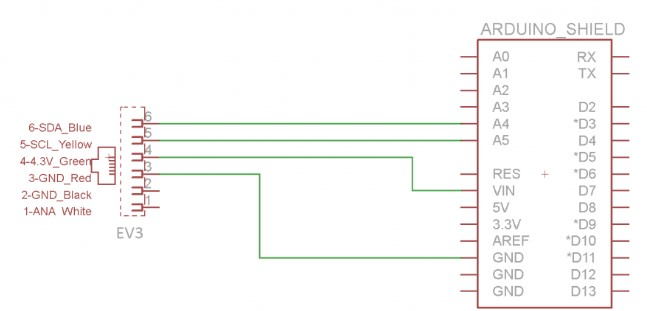
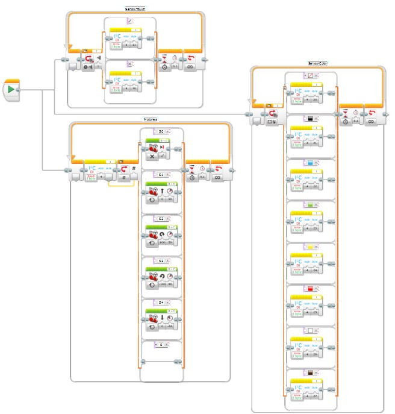

# Conectando ROS y EV3 mediante Arduino
# By: Felipe Cruz

# Contenido
En este repositorio se encuentra lo siguiente:
- README.md -> Archivo base con la descripción del laboratorio.
- Imgs -> Carpeta con imágenes utilizadas en el archivo README.
- Arduino -> Carpeta con códigos y librerías de Arduino utilizadas.
- Mindstorms -> Carpeta con proyectos y bloques de Lego Mindstorms Home Edition utilizados.
- ev3_arduino -> Packete de ROS creado en este proyecto para interactuar con el robot EV3.

Tabla de Contenidos
---

- [Conexión Arduino --- ROS](#conexión-arduino-----ros)
  - [Configuración del proyecto](#configuración-del-proyecto)
  - [Probando la conexión](#probando-la-conexión)
- [Conexión Arduino --- EV3](#conexión-arduino-----ev3)
  - [Conexión Física](#conexión-física)
  - [Programación Mindstroms](#programación-mindstroms)
  - [Probando la comunicación](#probando-la-comunicación)
- [Conexión ROS --- EV3](#conexión-ros-----ev3)
  - [Programa EV3](#programa-ev3)
  - [Programa Arduino](#programa-arduino)
  - [Programa ROS](#programa-ros)
- [Resultados](#resultados)

## Conexión Arduino --- ROS

Se tiene un computador Windows 10 con una máquina virtual VMWare Workstation Player V17 Linux Ubuntu versión 20.04. En el Windows 10 se instaló el IDE de Arduino y en la máquina virtual Linux se instaló ROS Noetic (junto con *catkin* -> http://wiki.ros.org/catkin).

Se conectará Arduino con ROS a través del paquete *rosserial*. Para esto, se siguen algunos de los ejemplos de la documentación oficial de *rosserial*, los cuales se encuentran en el siguiente link:

http://wiki.ros.org/rosserial_arduino/Tutorials

### Configuración del proyecto

Abrir una terminal dentro de la máquina virtual Linux Ubuntu y ejecutar lo siguiente:

```
sudo apt-get install ros-noetic-rosserial-arduino
sudo apt-get install ros-noetic-rosserial
```

En la terminal de la máquina virtual Linux, navegamos usando el comando *cd* hasta ubicarnos dónde queremos guardar la carpeta del proyecto que condendrá todos los programas, configuraciones y demás archivos necesarios para la conexión. Una vez ubicados en dónde se desee guardar esta carpeta, ejecutamos los siguientes comandos (la carpeta se llamará *ArduinoROS*):

```
mkdir ArduinoROS
cd ArduinoROS
mkdir src
catkin_make -DPYTHON_EXECUTABLE=/usr/bin/python3
source devel/setup.bash
```

Para verificar si todo funcionó correctamente, ejecutar el comando *ls* en la terminal y revisar que aparezcan 3 carpetas: *build*, *devel* y *src*.

Instalar *rosserial* dentro del proyecto Catkin que se ha creado anteriormente. Para esto, ejecutar los siguientes comandos en la terminal (si se uso *cd* para navegar por la terminal, regresar a la ubicación de la carpeta *ArduinoROS*):

```
cd src
git clone https://github.com/ros-drivers/rosserial.git
cd ..
catkin_make
catkin_make install
```

Para verificar si todo funcionó correctamente, ejecutar el comando *ls* en la terminal y revisar que aparezcan 4 carpetas: *build*, *devel*, *install* y *src*. Además, dentro de la carpeta *src* debe haber una nueva carpeta llamada *rosserial*.

Descargar el archivo *ros_lib.zip*, el cual se encuentra disponible en este repositorio en la ruta *Lab2b/Arduino/ros_lib.zip*.

Abrir el IDE de Arduino e instalar la librería *ros_lib*. Para esto, ir a *Sketch -> Include Library -> Add .ZIP Library*, tal como se muestra en la imagen:


Seleccionar el archivo *ros_lib.zip* que se descargó previamente. Para verificar que se realizó la instalación de manera correcta, ir a *File -> Examples*, y buscar *ros_lib* tal como se muestra en la imagen:


### Probando la conexión

Conectar un Arduino UNO al puerto USB del computador.

En nuestro caso, primero intentamos conectar el Arduino a la máquina virtual y probar la conexión pero no funcionó la compilación del código Arduino. El error se encuentra en la siguiente imagen:


Lo que hicimos, entonces, fue conectar el Arduino UNO al host (computador Windows) para compilar el código y subirlo. Luego, conectar el Arduino a la máquina virtual para probar la conexión con ROS (con el código ya ejecutándose en el Arduino). Para cambiar el Arduino del host a la máquina virtual, VMWare tiene una opción que permite hacer el cambio con un click, tal como se muestra en la siguiente imagen:


Abrir el IDE de Arduino y copiar el siguiente código, el cual se encuentra en *Arduino/ROSTest/ROSTest.ino*. Este corresponde con el ejemplo *HelloWorld* de la librería *ros_lib*:

```
#include <ros.h>
#include <std_msgs/String.h>
ros::NodeHandle nh; 
std_msgs::String str_msg;
ros::Publisher chatter("chatter", &str_msg);
char hello[13] = "hello world!";
void setup(){
    nh.initNode();
    nh.advertise(chatter);
}
void loop(){
    str_msg.data = hello;
    chatter.publish( &str_msg );
    nh.spinOnce();
    delay(1000);
}
```

Conectar el Arduino UNO al host (computador Windows) y subir el código al Arduino UNO. Para esto, utilizar las funcionalidades de la IDE de Arduino.

Detectar cuál es el nombre del puerto serial donde se encuentra conectado el Arduino dentro de la máquina virtual. Para ello, con una terminal abierta, realizar lo siguiente:

1. Ejecutar comando `cd /dev`
2. Ejecutar comando `ls`
3. Conectar el Arduino UNO a la máquina virtual
4. Ejecutar el comando `ls`
5. Revisar las diferencias entre los resultados del paso 2 y 4.

Lo obtenido del paso 2 y 4 varía de computador en computador. Como ejemplo, se muestra lo que se obtuvo para explicar qué debe buscarse dentro de la información. 

La siguiente imagen, muestra lo que se obtuvo en el paso 2:


La siguiente imagen, muestra lo que se obtuvo en el paso 4:


Resulta tedioso hacer esta revisión, pero es importante detectar dónde se conectó el Arduino dentro de la máquina virtual. Al comparar ambos resultados, podemos observar que al conectar el Arduino aparecen dos nuevos items en el listado: *serial* y *ttyACM0*. El que nos interesa es el que comienza con *tty*, en este caso **ttyACM0**.

Abrir 3 ventanas de la terminal.

Ejecutar el siguiente comando en la primera ventana de la terminal:

```
roscore
```

Se verá lo siguiente en la terminal:


Ejecutar el siguiente comando en la segunda ventana de la terminal:

```
rosrun rosserial_python serial_node.py /dev/ttyACM0
```

Acá se debe colocar el *tty* correspondiente al Arduino conectado (este es el nombre que detectamos anteriormente al revisar con *ls* la carpeta *dev* al conectar el Arduino a la máquina virtual).

Se verá lo siguiente en la terminal:


Ejecutar el siguiente comando en la tercera ventana de la terminal:

```
rostopic echo chatter
```

Si todo está funcionando correctamente, se verá lo siguiente en la terminal:


Con esto terminamos de probar la conexión, y para terminar la ejecución de las ventanas de la terminal, presionar *Ctrl + C* dentro de cada ventana.

## Conexión Arduino --- EV3

Se conectará Arduino con el robot EV3 mediante uno de los cables de sensor del robot EV3 utilizando el protocolo de comunicación I2C.

### Conexión Física

Para esta conexión, se sigue lo explicado en el siguiente link: https://www.dexterindustries.com/howto/connecting-ev3-arduino.

Se requieren los siguientes elementos:
- Robot EV3
- Arduino UNO
- Adaptador RJ12 hembra
- Placa Shield Syb-170 (opcional) -> Si no se tiene, usar protoboard
- Cables de colores

Los cables de sensores que se conectan al robot EV3 tienen terminales RJ12 tal como se muestra en la siguiente imagen:


Es complicado conseguir un conector RJ12 hembra que permita la conexión de estos cables debido a que el *buckle* se encuentra corrido a la derecha y la mayoría de conectores hembra tienen el espacio para el *buckle* en el centro.

Para este trabajo, logramos realizar la conexión a partir de un adaptador RJ12 genérico como el siguiente:


Los colores marcados en las patas son los colores correspondientes a los cables del RJ12. Se obtuvo la información mediante pruebas de continuidad.

Con un *motortool*, se removió el material de la esquina superior derecha para permitir la inserción del RJ12 macho. Luego, se soldaron cables a las 6 patas del adaptador para poder realizar conexiones en una protoboard.

Se utilizó la *Placa Shield Syb-170* para conectar el *Arduino UNO* y el adaptador RJ12 de manera compacta.


La conexión se hace siguiendo el siguiente esquemático:



Los colores mencionados en el esquemático coinciden con los colores marcados en la imagen del adaptador RJ12 hembra. Nótese que no se utiliza el color negro ni blanco, es decir, se puede evitar el uso de esas 2 patas para este proyecto.

Finalmente, conectar un cable de sensor del EV3 (RJ12) entre el puerto 1 del robot y el adaptador RJ12 hembra, tal como se muestra a continuación:


Para reducir el movimiento entre los cables, se pegó el circuito al EV3 con cinta.

### Programación Mindstroms

Para programar el robot EV3 se debe utilizar Lego Mindstroms Home Edition (**NO** el Education Edition), el cual se puede descargar de: https://www.lego.com/en-gb/themes/mindstorms/downloads.

Para realizar la conexión, se utiliza la librería para mindstorm desarrollada por Dexter Industries, la cual se encuentra en: https://github.com/DexterInd/EV3_Dexter_Industries_Sensors.

Instalar los bloques de la librería dentro de Lego Mindstorms tal como se ilustra en la imagen:


Dentro de Lego Mindstorms ir a *Tools* y seleccionar *Block Import*. Se debe buscar el arhchivo a instalar en *Browse*, el cual debe ser previamente descargado (este archivo se encuentra en este GitHub en *Mindstorms/Dexter.ev3b*). Se hace click en *Import*.

Para verificar que se instaló el bloque requerido, en la parte inferior de Lego Mindstorms ir a la pestaña amarilla (la de *sensores*) y verificar que aparezca el bloque I2C, tal como se muestra en la imagen:


El programa de prueba de conexión se encuentra en *Mindstorms/ArduinoTest.ev3*. Este programa se muestra a continuación:


### Probando la comunicación

Conectar el Arduino UNO que está sobre el robot EV3 al puerto USB del computador.

Abrir el IDE de Arduino y copiar el siguiente código, el cual se encuentra en *Arduino/EV3I2CTest/EV3I2CTest.ino*:

```
#include <Wire.h>
#define SLAVE_ADDRESS 0x04
int val, flag = 0;
void setup(){
  Serial.begin(9600);
  Wire.begin(SLAVE_ADDRESS);
  Wire.onReceive(receiveData);
  Wire.onRequest(sendData);
  Serial.println("Ready!");
}
void loop(){
  if (flag == 1){
    Serial.println(val);
    flag = 0;
  }
}
void receiveData(int byteCount){
  while (Wire.available() > 0){
    val = Wire.read();
    flag = 1;
  }
}
void sendData(){}
```

Subir el código al Arduino UNO. Para esto, utilizar las funcionalidades de la IDE de Arduino.

Encender el robot EV3 y habilitar el bluetooth del robot. 


Abrir Lego Mindstorms con el proyecto *ArduinoTest.ev3* abierto y en la parte inferior derecha darle a *Refresh*.


Conectar el robot EV3 mediante Bluetooth.

Abrir un monitor serial dentro del IDE de Arduino. Esto se logra con **Ctrl + Shift + m** o en *Tools -> Serial Monitor* (en el IDE).

Subir el programa al EV3 dando click en la flecha de *play* dentro de Lego Mindstorms.


Si la comunicación es correcta, se deberá obtener lo siguiente en el monitor serial de Arduino:


## Conexión ROS --- EV3

Esta conexión se logra utilizando el Arduino como puente. La infraestructura del proyecto se presenta a continuación:


Las flechas en Rojo representan la conexión necesaria para programar el Arduino y el EV3, respectivamente.

Además, la comunicación entre los diferentes componentes se representa de la siguiente manera:


Las comunicaciones dentro de ROS se harán mediante 2 topics que envían mensajes del tipo **UInt8** (enteros de 8 bits).

Se debe realizar 3 programas:

1. **Programa EV3:** Programa en Lego Mindstorms para que el robot EV3 envíe información de los sensores y reciba comandos para los motores, mediante I2C.
2. **Programa Arduino:** Programa en Arduino que recibe la información de los sensores mediante I2C y la publica en el topic de ROS. Y, lee comandos de movimiento desde el tópic de ROS y los manda por I2C al EV3.
3. **Programa ROS:** Programa en Python que lea la información de los sensores y publique comandos del usuario a través del topic de ROS. Para interactuar con el usuario se utiliza una interfaz gráfica.

### Programa EV3

Se tiene cierta limitación con los bloques de Lego Mindstorm. Tal como se observa en la imagen, solamente se tienen bloques para trabajar con el sensor de color, el sensor de contacto y el sensor infrarrojo.


Se decide trabajar solamente con el sensor de color y el sensor de contacto.

Se correrán 3 bloques en paralelo una vez iniciado el programa. Uno se encarga de enviar la información del sensor de color, otro se encarga de enviar la información del sensor de contacto y, el útlimo, se encarga de recibir comandos para los motores.

#### Programa Sensor de Color


Los demás colores se colocan de manera similar a lo que se ve en la imagen.

Este bloque representa la siguiente secuencia:

0. Repetir siempre
1. Detectar el color que lee el sensor de color
2. Switch del color -> En cada caso envía 1 byte usando el bloque I2C
3. Esperar 0.1 segundos antes de repetir

El caso default es *Sin color*.

La codificación de los colores es la siguiente:
| Color    | Byte |
|----------|------|
| Sin color| 20   |
| Negro    | 21   |
| Azul     | 22   |
| Verde    | 23   |
| Amarillo | 24   |
| Rojo     | 25   |
| Blanco   | 26   |
| Café     | 27   |

#### Programa Sensor de Contacto


Este bloque representa la siguiente secuencia:

0. Repetir siempre
1. Detectar si el sensor está presionado
2. Switch del contacto -> En cada caso envía 1 byte usando el bloque I2C
3. Esperar 0.1 segundos antes de repetir

La codificación de los estados del contacto es la siguiente:
| Estado        | Byte |
|---------------|------|
| Presionado    | 11   |
| No presionado | 10   |

#### Programa Motores


Este bloque representa la siguiente secuencia:

0. Repetir siempre
1. Leer 1 byte usando el bloque I2C -> Este byte codifica la acción a realizar
2. Switch de los motores -> En base al byte recibido hace alguna acción.
3. Esperar 0.1 segundos antes de repetir

La codificación de los estados del contacto es la siguiente:
| Byte | Acción                   |
|------|--------------------------|
| 50   | Detener motores          |
| 51   | Avanzar                  |
| 52   | Rotar hacia la derecha   |
| 53   | Rotar hacia la izquierda |
| 54   | Retroceder               |
| 0    | No hacer nada            |

El caso *0* es el caso por default. En caso de que se llegue a recibir algún otro valor (por ruido u otra razón), esto no afectará el funcionamiento del robot pues simplemente se ignorará dicho byte.

Los motores están configurados para funcionar al 50% de su potencia máxima.

El programa completo se muestra a continuación:



### Programa Arduino

El programa de Arduino actúa como puente entre el robot EV3 y ROS.

Se definen los siguientes topics de ROS:
| Topic    | Tipo de mensaje |
|----------|-----------------|
| sensores | UInt8          |
| motores  | UInt8          |

Los mensajes que se escriben por los tópicos serán enteros sin signo de 8 bits (*UInt8*). Esto resulta correcto para conectar con el programa del EV3 debido a que éste puede enviar y recibir bytes, que en todo caso son números de 8 bits.

El Arduino realizará lo siguiente:
0. Establecer un nodo en ROS para interactuar con los topics
1. Suscribirse al topic *motores*: Leer bytes del topic *motores* y enviarlos al robot EV3 mediante I2C
2. Publicar en el topic *sensores*: Recibir bytes del robot EV3 mediante I2C y publicarlos en el topic *sensores*

El código de Arduino se encuentra en *Arduino/Main/Main.ino*. Dicho código se muestra a continuación:

```
#include <Wire.h>
#include <ros.h>
#include <std_msgs/UInt8.h>

#define SLAVE_ADDRESS 0x04

uint8_t codeSensorEV3 = 0;
bool recepcionEV3 = false;
uint8_t codeMotorEV3 = 50;

void procesarMotores( const std_msgs::UInt8& comando){
  codeMotorEV3 = comando.data;
}

ros::NodeHandle rosNode;
std_msgs::UInt8 rosMsj;
ros::Publisher sensores("sensores", &rosMsj);
ros::Subscriber<std_msgs::UInt8> motores("motores", procesarMotores);

void setup() {
  // Conexión EV3
  Wire.begin(SLAVE_ADDRESS);
  Wire.onReceive(receiveEV3);
  Wire.onRequest(sendEV3);

  // Conexión ROS
  rosNode.initNode();
  rosNode.advertise(sensores);
  rosNode.subscribe(motores);
}

void loop() {
  // Procesar Motores
  // Los motores se procesan en las funciones sendEV3 y procesarMotores
  
  // Procesar Sensores
  if (recepcionEV3) {
    rosMsj.data = codeSensorEV3;
    sensores.publish( &rosMsj );
    recepcionEV3 = false;
  }

  rosNode.spinOnce();
}

void receiveEV3(int byteCount) {
  while (Wire.available() > 0) {
    codeSensorEV3 = Wire.read();
    recepcionEV3 = true;
  }
}

void sendEV3() {
  Wire.write(codeMotorEV3);
}
```

### Programa ROS

En la terminal de la máquina virtual Linux, navegamos usando el comando *cd* hasta ubicarnos dónde habíamos creado el proyecto de ROS en la sección [Configuración del proyecto](#configuración-del-proyecto). En nuestro caso, la carpeta se llama *ArduinoROS*. Ejecutar lo siguiente:

```
cd ArduinoROS
cd src
source devel/setup.bash
catkin_create_pkg ev3_arduino std_msgs rospy
```

Esto creará un nuevo paquete de ROS llamado **ev3_arduino** que incluye las dependencias *std_msgs* y *rospy*, la cuales sirven para trabajar con los mensajes estándar de ROS y python, respectivamente.

Para verificar la creación del paquete, correr lo siguiente en la terminal:

```
cd ev3_arduino
ls
```

Si todo va bien, aparece:

```
CMakeLists.txt  package.xml  src
```

Se recomienda abrir la carpeta completa *ArduinoROS* en un editor de código como *VSCode*. 

Se crea el archivo que contendrá el programa en Python para interactuar con el usuario y ROS. Esté archivo se llamará HMI.py y DEBE estar dentro de la carpeta *ArduinoROS/src/ev3_arduino/src*.

En el archivo *CMakeLists.txt*, se debe agregar lo siguiente (copiar y pegar al final del archivo):


```
catkin_install_python(PROGRAMS
  src/HMI.py
  DESTINATION ${CATKIN_PACKAGE_BIN_DESTINATION}
)
```

Si el archivo que se quiere crear tiene otro nombre, colocar dicho nombre en vez de *HMI.py*.

Ejecutar `catkin_make` en la terminal, ubicados en el archivo base (ArduinoROS). Si aún no se ha cerrado ni modificado la misma que se ha venido usando, ejecutar lo siguiente:

```
cd ..
cd ..
source devel/setup.bash
catkin_make
```

Revisar que la estructura de archivos de la carpeta ArduinoROS sea:


Para verificar que se configuró todo correctamente, ejecutar `roscore` en una terminal nueva y `rosrun ev3_arduino HMI.py` en la terminal que está en la carpeta *ArduinoROS*. Si todo está bien, se ejecuta el programa en Python (se puede probar poniendo algo sencillo como `print("Hola")`).

El código en Python para conectar a ROS con el Arduino hace lo siguiente:

1. Crea una interfaz gráfica
2. Lee el topic de ROS *sensores* y actualiza la información en la interfaz gráfica
3. Escribe en el topic de ROS *motores* en base a las teclas que el usuario presione

Copiar y pegar el siguiente código en el archivo *HMI.py*:

```
import rospy
from std_msgs.msg import UInt8
import tkinter as tk
from PIL import Image, ImageTk
from pynput import keyboard

__author__ = "Felipe Cruz"
__credits__ = ["Felipe Cruz"]
__email__ = "fcruzv@unal.edu.co"
__status__ = "Test"

# Control EV3
comandoEnviado = 0
comandoEV3 = UInt8()
comandoEV3.data = 0

# Crear la ventana de la interfaz gráfica
root = tk.Tk()
root.title("Control Lego EV3")

# Crear una función para PARAR
def STOP():
    exit()

# Colocar nombres y titulo
tk.Label(root, text="HMI para controlar robot EV3").pack()
tk.Label(root, text="Felipe Cruz").pack()

# Crear espacios para mostrar info
color_label = tk.Label(root, text="Color: ")
color_label.pack()
contacto_label = tk.Label(root, text="Contacto: ")
contacto_label.pack()

# Crear un botón para parar
move_button = tk.Button(root, text="PARAR", command=STOP)
move_button.pack()

# Definir la función callback para actualizar los valores en tiempo real
def subscriber(data):
    if(data.data == 20):
        color_label.config(text=f"Color: Sin Color")
    elif(data.data == 21):
        color_label.config(text=f"Color: Negro")
    elif(data.data == 22):
        color_label.config(text=f"Color: Azul")
    elif(data.data == 23):
        color_label.config(text=f"Color: Verde")
    elif(data.data == 24):
        color_label.config(text=f"Color: Amarillo")
    elif(data.data == 25):
        color_label.config(text=f"Color: Rojo")
    elif(data.data == 26):
        color_label.config(text=f"Color: Blanco")
    elif(data.data == 27):
        color_label.config(text=f"Color: Café")
    elif(data.data == 10):
        contacto_label.config(text=f"Contacto: No")
    elif(data.data == 11):
        contacto_label.config(text=f"Contacto: Sí")
    else:
        pass

def keyboardPress(key):
    global comandoEV3
    if key == keyboard.Key.up:
        comandoEV3.data = 51
    elif key == keyboard.Key.right:
        comandoEV3.data = 52
    elif key == keyboard.Key.left:
        comandoEV3.data = 53
    elif key == keyboard.Key.down:
        comandoEV3.data = 54
    else:
        comandoEV3.data = 50

def process():
    global comandoEV3
    global comandoEnviado
    rospy.Subscriber("sensores", UInt8, subscriber)
    publisher = rospy.Publisher("motores", UInt8, queue_size=10)
    if(comandoEnviado != comandoEV3.data):
        comandoEnviado = comandoEV3.data
        publisher.publish(comandoEV3)
   
def process_ui():
    # Revisar nodo activo
    if rospy.is_shutdown():
        return
    
    process() # Leer datos
    root.after(1000, process_ui)  # Actualizar

# Funcion principal
if __name__ == '__main__':
    # Inicializar nodo
    rospy.init_node('nodo_UI', anonymous=True)

    # Inicializar hilo del teclado
    keyboardManager = keyboard.Listener(on_press=keyboardPress)
    keyboardManager.start()

    # Iniciar un hilo para procesamiento de la UI
    process_ui()

    root.mainloop() # HMI
```

Si alguna de las librerías de Python no se encuentra instalada, se puede instalar ejecutando `pip install <nombre de la librería>` en la terminal.

## Resultados

### Ejecución programas

Para ejecutar el proyecto completo, se debe tener lo siguiente:

1. Máquina virtual abierta con 3 terminales localizadas en la carpeta *ArduinoROS*
2. Lego Mindstorms Home Edition abierto en el proyecto *ArduinoEV3.ev3*
3. Arduino IDE abierto con el código *Main.ino*
4. Arduino UNO conectado al computador y al robot EV3
5. Robot EV3 conectado a Lego Mindstorms por bluetooth

El proceso para ejecutar todo el proyecto de manera correcta es el siguiente:

1. Conectar el Arduino UNO al *host*
2. Subir el código *Main.ino* al Arduino UNO
3. Conectar el Arduino UNO a la máquina virtual
4. En la terminal 1 de la máquina virtual ejecutar `roscore`
5. En la terminal 2 de la máquina virtual ejecutar `rosrun rosserial_python serial_node.py /dev/ttyACM0`
6. Ejecutar el programa *ArduinoEV3.ev3* en el robot EV3
7. En la terminal 3 de la máquina virtual ejecutar `rosrun ev3_arduino HMI.py`
8. Usar las flechas del computador para mover el robot y la HMI de Python para observar lo que leen los sensores

Si algún comando de la terminal no funciona, ejecutar `source devel/setup.bash` y luego intentar otra vez.

Para terminar la ejecución:
1. En Lego Mindstorms detener la ejecución del programa
2. En la HMI de Python presionar el botón de PARAR
3. En la terminal 1 y 2 presionar **Ctrl + C**

### 